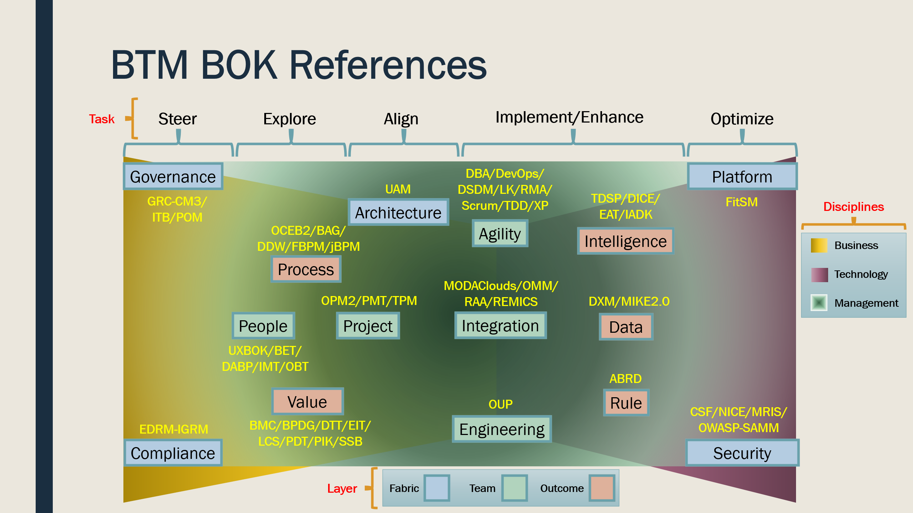
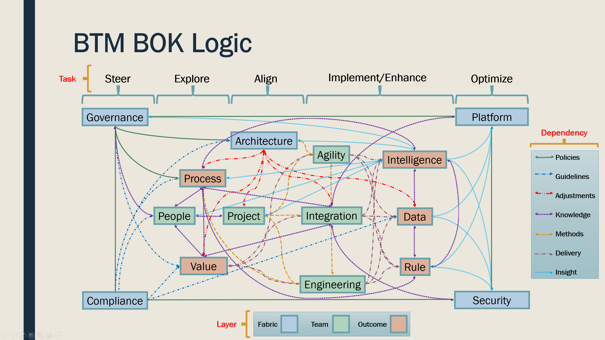

# BTMBOK

Business Technology Management (BTM) Body of Knowledge (BOK)
============================================================

BTM BOK is a guide to the unified professions of IS/IT management.

https://www.btm-forum.org/standards/bok

It is delivered in a single Eclipse Process Framework (EPF) Method Library and Wiki, and reuses primarily 100+ CC BY-SA, EPL 1.0, & EUPL 1.2 references. Other licenses include CC-BY, Apache, MIT, etc.

We reuse contents from several academic and professional projects, whether from vendors, government, associations, universities, open source initiatives.

https://www.btm-forum.org/standards/bok/integration

Please join the BTM Forum if you wish to lend support in any way or contribute to the BTM BOK:

https://www.btm-forum.org

Ou editorial team is still being recruited, we would greatly appreciate your involvement:

https://www.btm-forum.org/standards/bok/teams

Please contact the project leader for more information:

Stéphane Gagnon, Ph.D., Associate Professor, Université du Québec en Outaouais (UQO), Gatineau, QC (near Ottawa, ON), Canada

stephane.gagnon@uqo.ca

http://gagnontech.org

https://www.linkedin.com/in/gagnon/

