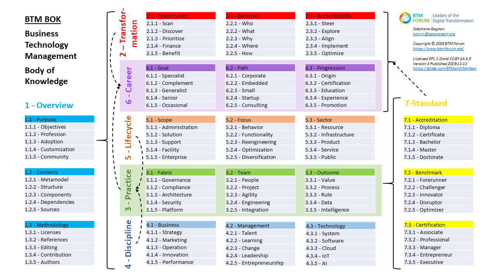
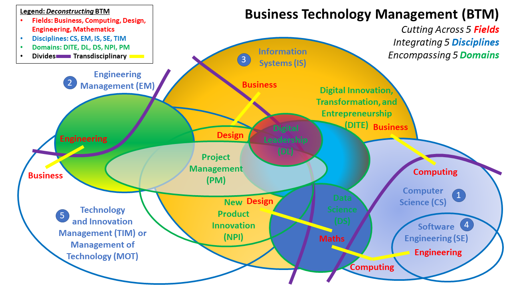

# BTM BOK

Business Technology Management Body of Knowledge (BTM BOK)
============================================================

**Summary**

BTM BOK is a guide to the unified professions responsible to lead Digital Innovation, Transformation, and Entrepreneurship (DITE) projects. 

BTM is a broader definition of DITE professional roles. It still includes primarily the traditional IS/IT management practices, generally located within the Chief Information Officer (CIO) branch. But BTM also integrates Out-of-IT roles, such as Chief Digital Officer (CDO), Digital Product Manager, Digital Marketing, Data Scientists, etc. It is also concerned about digital literacy among all other professional roles involved in DITE projects.

BOK assets are delivered in a single Eclipse Process Framework (EPF) Method Library and Wiki, and reuse primarily 100+ CC BY-SA, EPL 1.0, & EUPL 1.2 references, with some under freer licenses such as CC-BY, Apache, and MIT.

**Practices**

BTM BOK doesn't reinvent the wheel, but instead intends to connect readily existing industry certifications and standards. We focus on specifications covering the whole range of Digital Transformation roles and tasks.

**References**

We reuse contents from several academic and professional projects, whether from vendors, governments, associations, universities, or open source initiatives. All must be already published under a compatible open-source or open-access license.

**Repo Contents**

__[BTM-BOK-001](BTM-BOK-001)__

BTM BOK assets are published using the Eclipse Process Framework (EPF) platform. Contents are published in XMI under this repo folder. Each practice integrated is a sub-folder.

__[doc](doc)__

A general introduction to BTM BOK is being coauthored by several contributors. Contents are published in DOCX and PDF. All figures are provided in either VSDX, PPTX, or PNG/JPG/GIF formats.

__[guide](guide)__

Potential contribtors can learn from BOK editing practices in 5 pages under the guide folder:
- [Objectives](guide/objectives.md)
- [Integration](guide/integration.md)
- [Editing](guide/editing.md)
- [Tools](guide/tools.md)
- [References](guide/references.md)

**Contact**

Please contact us to get involved:

- Stéphane Gagnon, Ph.D.
- Associate Professor
- Université du Québec en Outaouais (UQO)
- Gatineau, QC (near Ottawa, ON), Canada
- stephane.gagnon@uqo.ca
- https://gagnontech.org
- https://www.linkedin.com/in/gagnon/

**BTM as a Transdisciplinary "Super-Field"**

