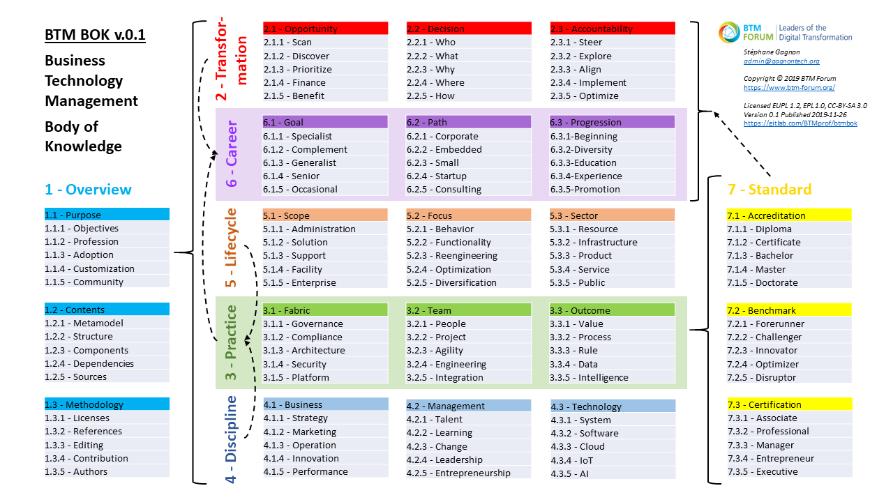

# BTMBOK

Business Technology Management (BTM) Body of Knowledge (BOK)
============================================================

**Summary**

BTM BOK is a guide to the unified professions of IS/IT management.

It is delivered in a single Eclipse Process Framework (EPF) Method Library and Wiki, and reuses primarily 100+ CC BY-SA, EPL 1.0, & EUPL 1.2 references, with some under freer licenses such as CC-BY, Apache, and MIT.

**Practices**

BTM BOK doesn't reinvent the wheel, but instead intends to connect readily existing industry certifications and standards. We focus on specifications covering the whole range of Digital Transformation roles and tasks.

**References**

We reuse contents from several academic and professional projects, whether from vendors, governments, associations, universities, or open source initiatives.

**Contact**

Please contact us to get involved:

Stéphane Gagnon, Ph.D., Associate Professor, Université du Québec en Outaouais (UQO), Gatineau, QC (near Ottawa, ON), Canada

stephane.gagnon@uqo.ca

https://gagnontech.org

https://www.linkedin.com/in/gagnon/

