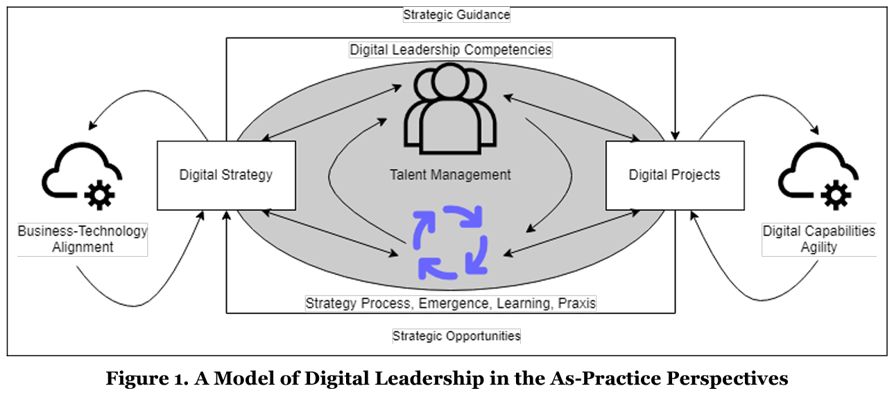

# Open Access BTM Texbook and Courseware: Call to Action

**Proposal**

Teaching faculty and students in higher education require access to a new form of textbook to introduce managers to digital leadership, with different scope of learning at undergrad and grad levels.

We invite the academic and practitioner community to work on a new free and open-access BTM courseware, all published under CC BY to ensure widest adoption and customization: 

https://creativecommons.org/licenses/by/4.0/

- Book (12 chapters)
- Cases (3 per chapter, 2 small and 1 large)
- Appendices (overviews: technologies, BTM, careers)
- Readings (links to resources)
- Presentations (powerpoints)
- Tutorials (videos)
- Exams (samples)

This suite of free and customizable assets will be published as complements to the BTMBOK, which has a different audience, being primarily an open index of BTM competencies, not a pedagogical tool, but valuable free contents to be reused-refactored into courseware.

We do not aim to replicate existing excellent open-access courseware, such as the one developed by David Bourgeois and his team, adopted by 70+ universities worldwide.

https://opentextbook.site/

Instead, we must explore how to improve the learning process and how best to help practitioners. 

**Philosophy**

The overall pedagogical philosophy could follow a more "pragmatic" approach to introducing digital leadership to non-IS/IT managers, or specialists of other business disciplines.

Existing textbooks and intro courses tend to present Information Systems primarily as "theory and general knowledge", with practice elements covered in cases, mostly aligned to serve "illustrations of theory" as opposed to "building from practice".

This 2022 AMCIS paper proposes to adopt a "Digital-as-Practice" perspective, building upon and integrating other "as-practice" perspectives, e.g., Strategy, Project, Leadership, etc.

Gagnon, Stéphane. (2022). "Digital Project Leadership and Talent Management in the As-Practice Perspective". AMCIS 2022 Proceedings. 

https://aisel.aisnet.org/amcis2022/conf_theme/conf_theme/2

**Outline**

One key issue is the textbook learning sequence, which needs to be linear and made of building blocks, and present BTM from a pragmatic perspective while referencing theory extensively.

Various knowledge elements can help learners "grow into their role" as managers concerned with IS/IT, who may wish to become digital leaders.

Roles should be generic and simple, so as to stick to the reality of learners, who can envision being observers of business and IT, end-users, etc. up to strategy makers and entrepreneurs.

Part A: User
- Ch.1: Observer
- Ch.2: Customer
- Ch.3: Employee

Part B: Contributor
- Ch.4: Decision Maker
- Ch.5: Needs Assessor
- Ch.6: Functionality Tester

Part C: Orchestrator
- Ch.7: Project Participant
- Ch.8: Implementation Advisor
- Ch.9: Acquisition Advisor

Part D: Creator
- Ch.10: Strategy Maker
- Ch.11: Product Leader 
- Ch.12: Entrepreneur

In each chapter, students study some key aspects of IS/IT that lead them to leverage their prior knowledge of the roles to better understand its interfaces with digital opportunities and challenges.

Part A: User
- Ch.1: understanding organizations, information processing, IS/IT components and cloud, configurations adapted to business context/size, IS/IT leadership roles
- Ch.2: e-commerce and mobile revolution, quality of service, cybersecurity and trust, IoT and cyber-physical systems, ethical concerns
- Ch.3: crossfunctional integration, enterprise systems (ERP, CRM, SCM, etc.), BPM and redesign, AI and automation, quality of life and future of work

Part B: Contributor
- Ch.4: real-time performance and control, big data analytics and BI, dashboards and visualization, business rules, robotics and self-adaptive multi-agent systems
- Ch.5: requirements management, systems specifications, enterprise architecture, regulatory compliance, risk management
- Ch.6: user experience (UX), process and interface design, test-driven development, testing and issue reporting, DevOps

Part C: Orchestrator
- Ch.7: digital projects, project management, agile methods, team knowledge management and reuse, business relationship management (BRM)
- Ch.8: services and systems adoption, organizational culture, strategic transformation, training and learning, subject-matter expert
- Ch.9: open-source and intellectual property rights, application procurement lifecycle, services management, IT governance and audits, financial assessment and pricing

Part D: Creator
- Ch.10: digital opportunities and challenges, market dynamics, business-technology alignment, business models, strategic configurations
- Ch.11: digital product and service innovation, technology strategy, e-marketing and customer analytics, program and portfolio management, strategic alliances and ecosystem
- Ch.12: digital incubation lifecycle, startups and funding, innovation champions and coaching, legal environment, international expansion and born global

