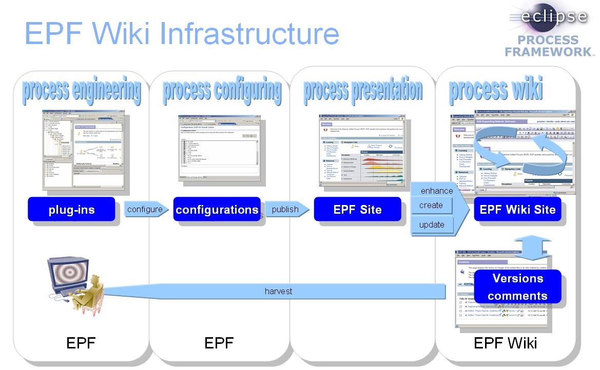
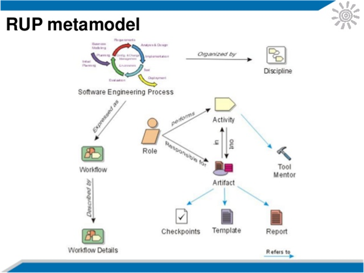
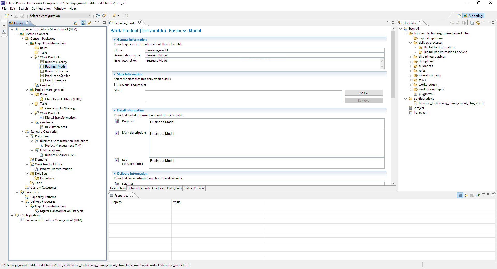
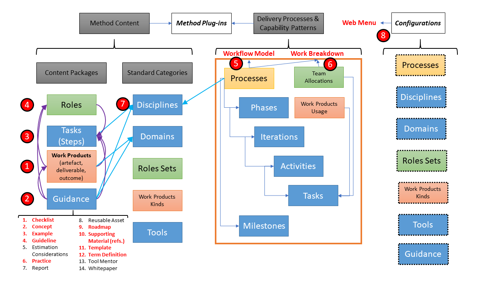

# Editing

Our development methodology relies on the Eclipse Process Framework (EPF), which comes with readily developed practices, such as the Open Unified Process (OpenUP), Scrum, Extreme Programming, Agile Business Rules Development (ABRD), and DSDM. The main feature of EPF is the Composer, a set of extensions installed within the Eclipse Integrated Development Environment (IDE). They are published in a wiki to enable the collaborative editing of open assets, which are then reintegrated as new assets.

- http://www.eclipse.org/epf/composer_architecture/
- https://www.eclipse.org/epf/general/EPFComposerOverviewPart1.pdf
- https://www.eclipse.org/epf/general/EPFComposerOverviewPart2.pdf
- http://www.etsmtl.ca/Professeurs/rchampagne/documents/epftutorial/index.html

Our editorial team is responsible for separate and loosely (unsynchronized) related tasks:

- Use the EPF Composer to design the BTM BOK framework and integrate various external assets
- Use the EPF Wiki to maintain and add contents and citations to external BOKs and references
- Use EPF Wiki API extensions to help reuse BTM BOK assets into key Talent Management tasks

The EPF Composer is used to develop the “plug-ins” that contain various BTM BOK assets, integrated within various “process configurations” describing BTM certification levels. The EPF Wiki is used to host the EPF site that helps to navigate the BTM BOK assets and allows registered users to comment and edit the BTM BOK guide (limited to the team and assessors for the first year).

Our selected FLOS assets will be aligned with our digital transformation lifecycle and maturity model. The BTM BOK core language will help integrate assets around the core elements of the EPF framework, as defined by the Object Management Group (OMG) Software Process Engineering Metamodel (SPEM 2.0), initially developed by IBM for the Rational Unified Process (RUP). The generic schema is easy to align to and makes the resulting framework seamless to integrate several specifications:

- Process: Overall digital transformation lifecycle and maturity model to align all sub-processes.
- Disciplines: 20+ BTM specializations and their main external BOK references.
- Workflows: Broad integrated activities guiding BTM leaders to master the digital lifecycle.
- Workflow details: Sub-processes connecting the competencies of the 20+ BTM specializations.
- Role: BTM certification levels regrouping the 20+ BTM specializations and their roles.
- Activity or Task: Competencies required by the 20+ external BOKs and defining the job roles.
- Artifact or Work Products: Expected input and output of the typical digital lifecycle tasks.
- Tools and Tool Mentor: Tools recommended to BTM professionals to perform the various tasks.
- Guidance, Checkpoints, Templates, and Reports: External references to best practices.

The EPF Composer presents several challenges for beginners, but once standard packages have been analyzed, most users are able to understand the logic and relationships between components. These serve to establish editorial priorities and help guide the team in large collaborative development efforts.

Several components must be edited in specific sequence to ensure all referenced material is properly classified and integrated.

