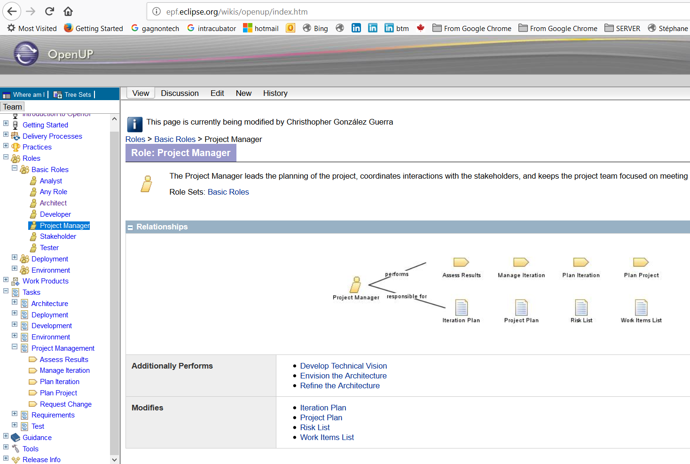
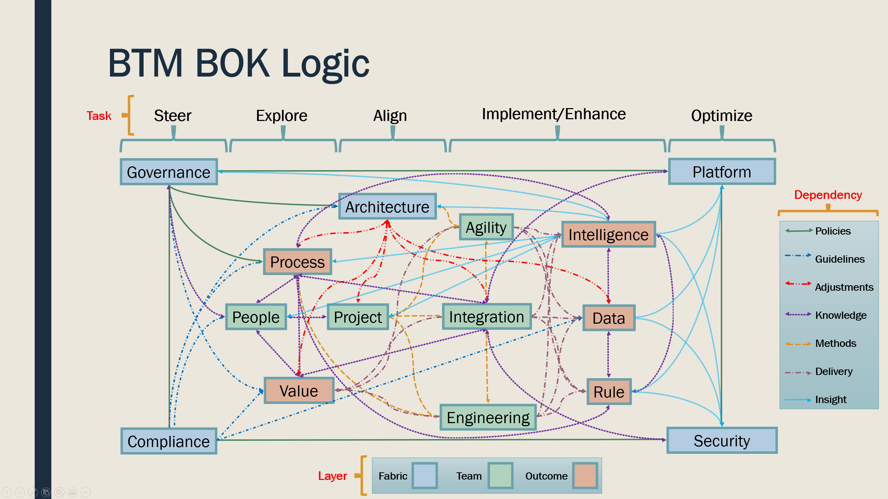
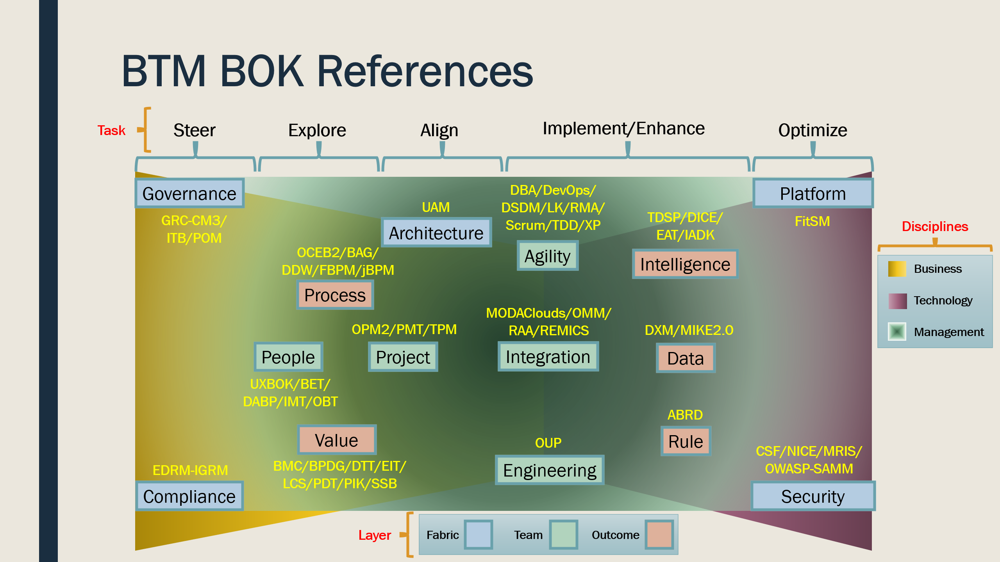

# Integration

The BTM BOK will serve as a generic core language to integrate several Free, Libre, Open Source (FLOS) specifications, methodologies, reference models, and standards. These have been published under open commercial licenses, such as Eclipse Public License 1.0 (EPL 1.0), European Union Public License 1.2 (EULP 1.2), Creative Commons Attribution-SharelAlike 3.0 Unported (CC BY-SA 3.0), and other more liberal licenses such as CC BY 4.0 International, Apache License, MIT License, etc. When assets contain separate contents with varying licenses, only the commercially reusable contents are used, to avoid limiting the reuse of our BOK by all organizations.

The BTM BOK is delivered in a single Eclipse Process Framework (EPF) Wiki, developed through an open community effort to simplify the relationships between several BOKs. It is supported by multiple citations to academic and professional literature, helping learners find the most trusted sources. It is also highly open and customizable, with API to reuse its contents in various Talent Management functions (e.g., custom BTM-compliant job descriptions, automated matching of CVs and job competencies, learning path recommendations given prior experience for recognized BTM careers, etc.).

The resulting wiki contents are structured along a simple menu-driven navigation, allowing to quickly pinpoint BTM BOK contents of interest, as well as map thoroughly the relationships between all components.

The FLOS assets will cover initially 15 core practice or competency areas (more to come soon, suggestions welcomed) of digital transformation leadership, starting with those where references are readily available. Logical models are being explored, first classifying practices broadly along the 3 disciplines of the BTM profession: business, technology, and management.

We can also model BTM following basic questions about digital transformation, with a more“dynamic” model, representing constant change and fluid state of BTM initiatives. The 15 initial practice areas can be identified by the “level” or layer of the organization they impact on: fabric (blue) as where and why of digital transformation, team (green) as who and how of digital transformation, and outcome (orange) as what and how much of digital transformation. BTM experts are accountable for 6 joint tasks to accomplish digital transformation, and are bound by a primary dependency, among many more forms of collaboration to develop shared foundations and practices.

