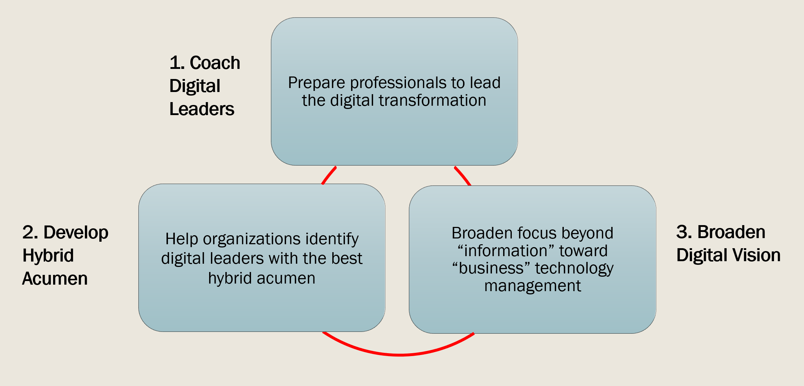
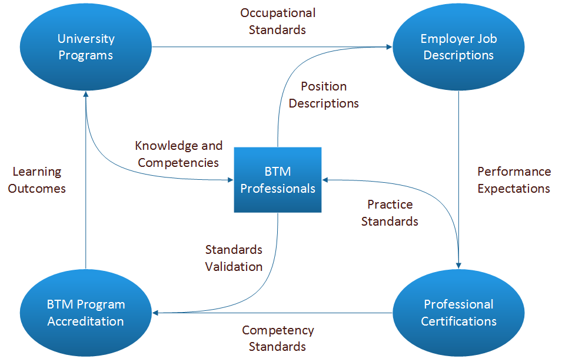
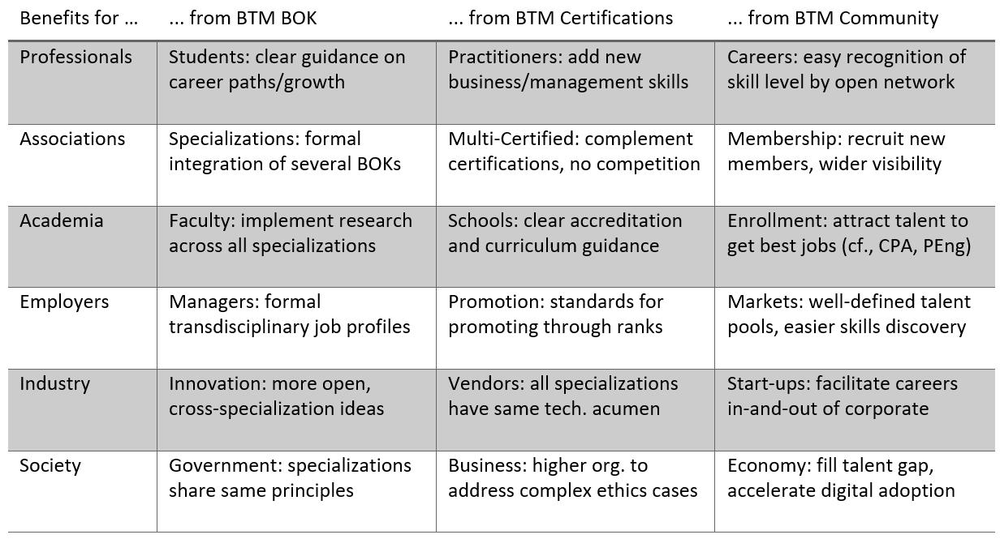

# Objectives

The BTM BOK project was launched in Fall 2017 [in partnership with ITAC, MITACS and Université du Québec en Outaouais (UQO)](https://itac.ca/blog/itac-partnership-receives-funding-mitacs-btm-body-knowledge/).

The _main objective_ of the BTM BOK is to equip the BTM community with a Free, Libre, Open Specification (FLOS) to help guide the digital transformation and fulfill the BTM Forum mission, namely (1) coach digital leaders, (2) develop hybrid acumen, and (3) broaden digital vision.

In addition, _secondary objectives_ of the BTM BOK relate to supporting various Human Resources Management (HRM) and Talent Management processes.

In particular, the BOK will help define seamless career paths across multiple specializations to ensure more complete experience and knowledge for digital transformation.

The core meta-model or framework of our BOK, building upon and integrating existing practices, will ensure digital leaders at all levels can rely on a logical progression of the common core competencies of their profession.

The BOK can be used for certification of digital leaders at Associate, Professional, Entrepreneur, Manager, Executive, and Fellow levels.

The BOK can also serve for accreditation of degree programs, better defining the logic of Learning Outcomes (LOs), and gauge which school is most innovative, and clarify which one is best for each digital leader as per their stage and path of professional growth.

The _potential benefits_ of the BTM BOK span all segments of the profession, whether professionals, associations, academia, employers, industry vendors, and the economy and society in general.

