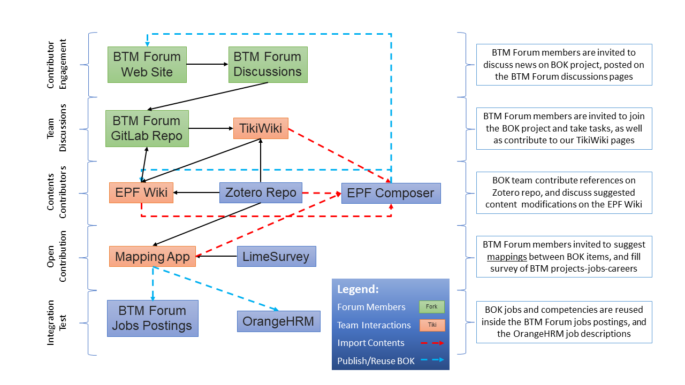

# Editing Tools

Several applications are used to develop the BTM BOK.

The following 6 apps are most important for the collaborative DevOps methods used to develop and publish BOK assets on GitLab. These apps fit within a Continuous Integration / Continuous Integration Development (CI/CD) cycle.

## [Editing App](http://www.btm-forum.org/boks)

[**Editing App Demo**](https://www.btm-forum.org/images/bok/video/core-btm-bok.mp4)

BTM BOK serves as a reference web site to guide practitioners at all levels of Competency: Associate, Professional, Manager, and Executive. It provides a generic core model "centered" on business value and technology, instructing what knowledge and certifications are required to enter new BTM positions and guiding upcoming digital leaders toward the common core competencies of their profession. The [Eclipse Process Framework (EPF) Composer](https://www.eclipse.org/epf/) is used to develop and design the BTM BOK library integrating various external plugins and assets in a single BOK. The [EPF Wiki (a Ruby app)](https://wiki.eclipse.org/EPF_Wiki_User_Guide) is used to publish, maintain and add contents to the BOK developed in EPF. A Zotero references app is developed and integrated in EPF Wiki to allow for easy insertion of academic and professional literature citations.

## [Mapping App](https://www.btm-forum.org/bok-mapping/)

[**Mapping App Demo**](https://www.btm-forum.org/images/bok/video/btm_bok_mapping.mp4)

BTM BOK mapping application allows members to create mappings or associations between various industry standards and BTM positions to identify and create competencies. Currently 1729 standards and 33 positions information are added and ordered hierarchically. The mapping app also includes adding references and citations through an integrated Zotero references manager app. Each member's created mappings and content can be shared with other members or kept private according to the member intent.

## [Citation App](https://www.zotero.org/groups/1145457/btm)

[**Citation App Demo**](https://www.btm-forum.org/images/bok/video/btm_bok_apps_cite.mp4)

*Zotero* is a free references management software used to manage, collect, organize, cite, and share research. A Zotero referencing app is developed and integrated in BTM BOK apps. To add your references and use them to cite the content inside our apps, you need to:
- Download and install Zotero desktop
- Join the BTM BOK Zotero references group on the web
- Import references from any journal into your local Zotero desktop app
- Add your references into the BTM group using your local Zotero desktop app
- Sync from local to web group
- Reference and cite the content on the apps as shown on the demos.

## [Community App](http://www.btm-forum.org/bok-community)

[**Community App Demo**](https://www.btm-forum.org/images/bok/video/btm_bok_community.mp4)

BTM BOK Community (TikiWiki) app aims to creating a knowledge hub for everyone who is interested in the subject to participate and collaborate. It provides members with a wiki-like environment where they can comment, create, add content to discuss various BTM BOK topics and literature. This allows enhancing BTM BOK community knowledge base and encourages sharing and collaboration.

## [Survey App](http://www.btm-forum.org/btm-survey/admin)

[**Survey App Demo**](https://www.btm-forum.org/images/bok/video/btm_bok_survey.mp4)

BTM BOK Survey application (a LimeSurvey app) enables easily creating surveys to be used to build case studies and career paths.

## [HRM App](http://www.btm-forum.org/btm-hr)

[**HRM App Demo**](https://www.btm-forum.org/images/bok/video/btm_bok_hrm.mp4)

BTM BOK Human Resources Management (OrangeHRM) application is used for integrating with other apps to matchmaking between jobs description and candidates. This is a proof of concept to leverage BTM BOK and reuse its job description flexibly.

